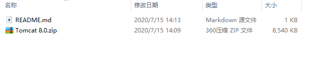
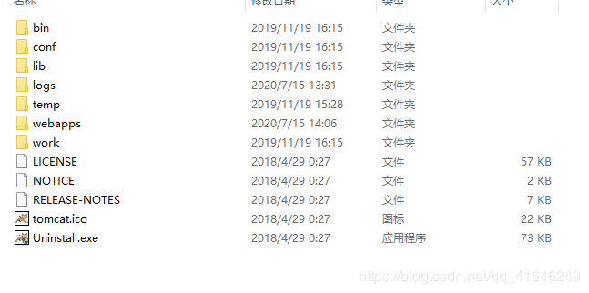
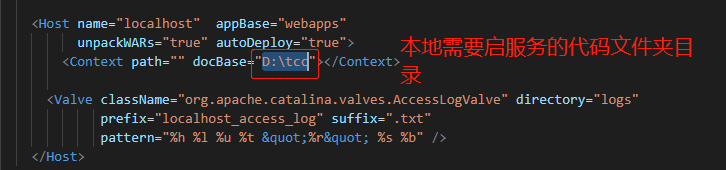
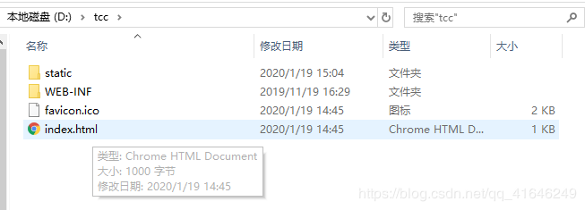
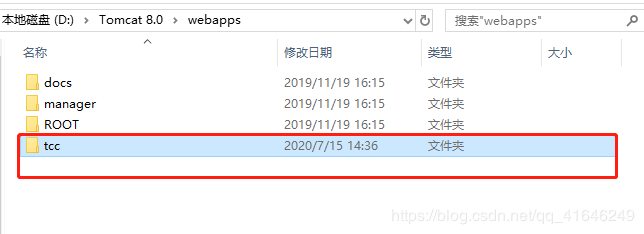
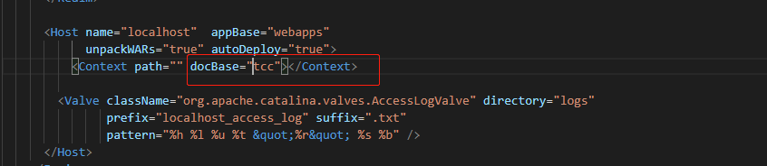
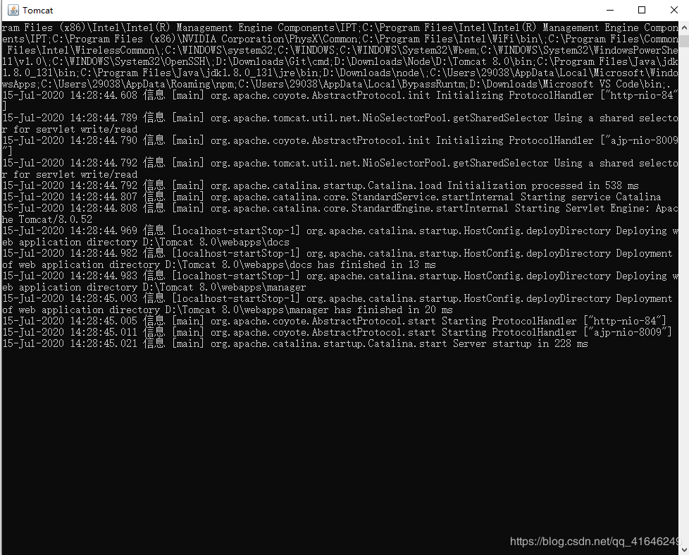
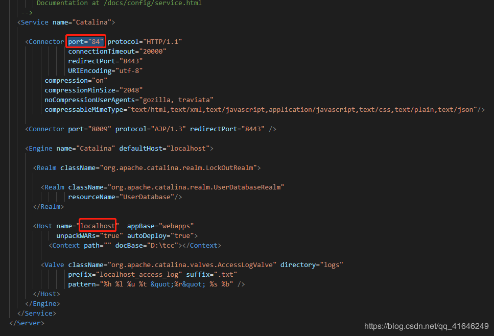

1. Tomcat_8.0压缩包密码：123456
一、先去下载Tomcat8.0的包：

github地址： https://github.com/nieyangyang712/Tomcat_8.0

百度云盘地址：链接: https://pan.baidu.com/s/1kCZSwt-Nj4qla5BSCuIU3Q 提取码: k7at

二、拿到Tomcat8.0包后解压后目录如下：

三、修改配置文件，服务文件： 在conf文件夹里面的：server.xml

我这里把打包后的文件放在了D盘 tcc 文件里面了：

 

 注意：看你的打包代码放在哪了，根据自己的需要写路径；

附加：其实也可以把打包后的代码放在： Tomcat 8.0\webapps 里面

如下图：

然后更改配置文件server.xml 里面的路径 

 四、启动项目

在文件夹：Tomcat 8.0\bin 下面的 startup.bat文件 鼠标双击启动

如下图就成功了；

五、在浏览器地址栏输入访问地址： http://localhost:84/

为什么这么输入呢？看下图我的这个配置文件的地方是这么配置的，端口是：84，网址是：localhost

如果不想用我这可以自行修改这2个地方； 

六、项目启动成功： 

————————————————
版权声明：本文为CSDN博主「yy.n」的原创文章，遵循CC 4.0 BY-SA版权协议，转载请附上原文出处链接及本声明。
原文链接：https://blog.csdn.net/qq_41646249/article/details/107359373